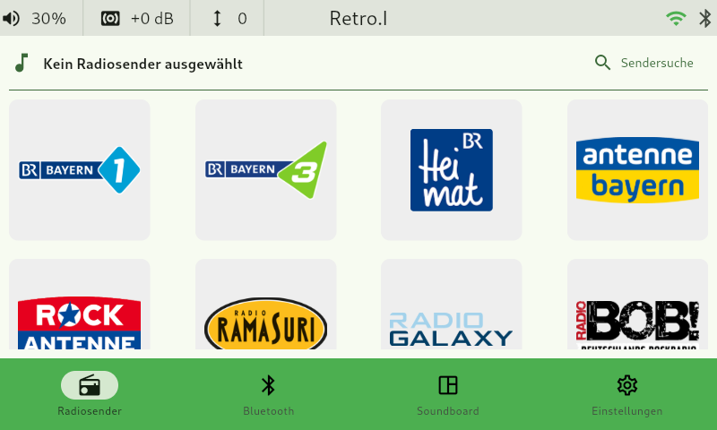
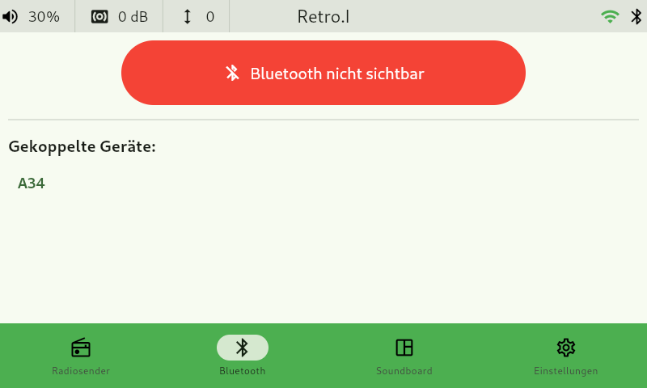
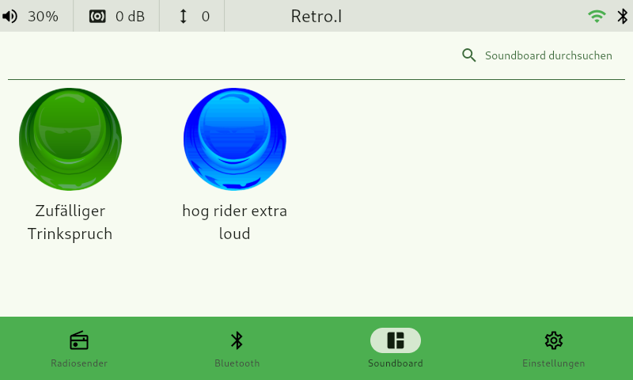
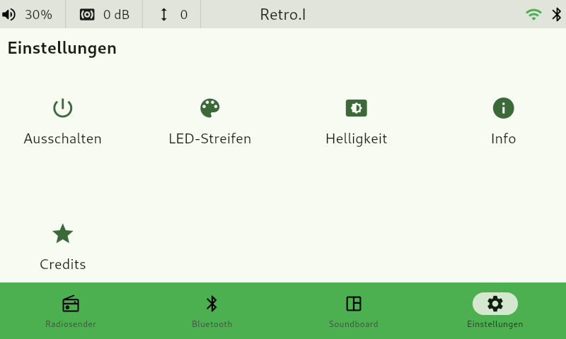
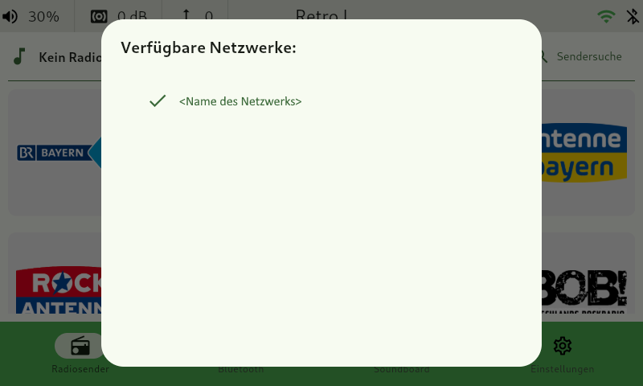
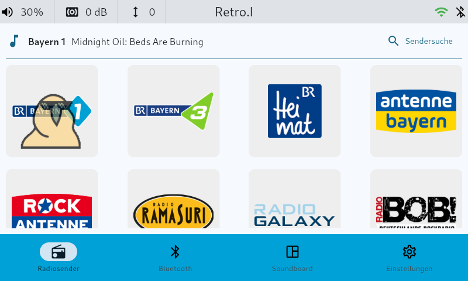

# Retro.I
 \
Ein Projekt der FWI1 des BSZ-Wiesau\
Einem **Grundig Type 5088**, Baujahr **1957/1958**, wird neues Leben eingehaucht!\
Dazu werden folgende Technologien verwendet:
* Raspberry PI 4 (4GB)
* Python
* Flet
* easyeffects

Folgende Hardware wurde verwendet:
* WS2812B LED-Streifen
* Rotary Drehregler
* 4 Passiv-Lautsprecher
* Touch-Display
* Verstärker-Platine
* 24V Schaltnetzteil

## Setup
Zum Aufsetzen des Radio's wird ein vollautomatisches Setup-Skript verwendet!\
Es sind dabei folgende Schritte zu beachten:

### Raspberry PI Image
Das Setup-Skript wurde lediglich auf einem `Raspberry PI OS (64-bit) "Debian Bookworm"` Image getestet.
> Dass das Setup-Skript auf anderen OS' funktioniert ist nicht ausgeschlossen, aber auch nicht garantiert!

Dieses Image kann über den **offiziellen** Raspberry-PI-Imager heruntergeladen und auf einer SD-Karte installiert werden.
Dabei ist folgendes zu beachten:
* WLAN einrichten
* Geeigneten Benutzernamen für den Raspberry setzen

### Projekt klonen
```commandline
git clone https://github.com/felixholfelder/Retro.I.git
```
Im Normalfall, sollte `git` schon vorinstalliert sein. Sollte dies nicht der Fall sein, kann `git` mit folgendem Befehl installiert werden:
```commandline
sudo apt-get install git -y
```

### Setup.sh ausführen
Wechsle mit `cd Retro.I` in das Verzeichnis des Projekts und führe mit
```
./setup.sh
```
das Setup-Skript aus.
> Sollte ein Schritt in diesem Skript fehlschlagen, kannst du in der [SETUP.md](SETUP.md) nachschlagen.\
> Dieses Skript ist wahrlich kein Hexenwerk, weswegen die einzelnen Command's auch per Hand ausgeführt werden können!

<!-- TODO - noch in Arbeit!!!
## Updates
Bei jedem Boot des Raspberry's wird ein Update-Skript (`update.sh`) ausgeführt.\
Dieses Skript prüft, ob neue Updates verfügbar sind, indem es die aktuelle Tag-Version auf dem Raspberry mit dem neuesten Tag im Github-Repo vergleicht.\
Ist ein neues Update für die Anwendung verfügbar wird der neueste Tag heruntergeladen.
-->

## Bedienung

### Lautstärke
Die Lautstärkenregelung erfolgt über den original Drehknopf des Radios!\
Der Rotary Drehregler gibt sein Signal an den Raspberry weiter und dieser steuert die Lautstärke des Geräts.

### Stummschaltung
Der Wechsel von Stummschaltung/Aufhebung erfolgt über Drücken des gleichen Drehreglers wie zur Veränderung der Lautstärke.

### Bass/Höhen
Die Veränderung von Bass/Höhen ist über weitere Rotary-Drehregler möglich! Hierzu wird die Software `EasyEffects` verwendet:\
`sudo apt install easyeffects`

### WS2812B LED-Streifen
TODO - Setup-Skript erweitern, dass die Anzahl der LED's beim Setup angegeben werden kann

Der LED-Streifen mit `62` LED's wird ebenfalls über den Raspberry angesteuert.\
Jeder Radiosender verfügt über eine Farbe, welche den Radiosender repräsentiert. Diese Farbe wird bei Auswahl des jeweiligen Radiosenders auf dem Streifen in einer Animation angezeigt.

## Start der Anwendung
Solltest du die Software manuell starten wollen, sollest du folgendes beachten

## Features/Software
### Radio
 \
Auf dieser Seite können die voreingestellten Radiosender abgespielt, gelöscht und neu hinzugefügt werden.\
Um einen Sender von der Favoriten-Seite zu entfernen, muss lange auf den Sender getippt werden.\
Um neue Sender zu suchen und hinzuzufügen, muss nach diesem im Such-Dialog (oben rechts) gesucht werden

### Bluetooth
 \
Möchte man den Radio als **Bluetooth-Box** verwenden, ist dies in diesem Tab möglich.\
Dabei stoppt der aktuell spielende Radiosender und Bluetooth wird aktiviert.\
Wechselt man wieder zurück zum Radio-Tab, werden alle Bluetooth-Verbindungen gekappt und Bluetooth systemweit deaktiviert. Das verhindert das ungewollte Verbinden, während des Radio-Betriebs!

Wenn du ein neues Gerät mit dem Radio verbinden möchtest, musst du **Bluetooth-Discovery** aktivieren! (Bluetooth sichtbar/nicht sichbar)

### Soundboard
 \
Hier befindet sich ein komplett konfigurierbares Soundboard.
Es kann nach Sounds gesucht und diese zum eigenen Soundboard hinzugefügt werden.

### Einstellungen
 \
Über diese Seite kann der Radio unter folgenden Punkten konfiguriert werden:
* Helligkeit des LED-Streifen bzw. generell leuchten/nicht leuchten
* Helligkeit des Touch-Bildschirms

Zusätzlich können weitere Informationen wie z.B. WLAN-Konfiguration entnommen werden.

Nicht zuletzt, werden die Personen aufgeführt, dank Ihnen dieses Projekt zu einem großen Erfolg wurde!

## Anzeige Lautstärke
Die Lautstärke wird über einen Rotary-Drehregler gesteuert.\
Durch den verbauten LED-Streifen wird bei Änderung der Lautstärke eine Animation angezeigt.\
Bei Stummschaltung (durch Druck des Drehreglers) erscheint der LED-Streifen in der Farbe Rot.\
Beides wird ebenfalls in der oberen Taskleiste dargestellt.

### Auswahl WLAN-Netzwerk
Ebenfalls ist über das WLAN-Icon in der oberen Taskleiste die Auswahl des WLAN-Netzwerks möglich:


### Aktuell spielender Radiosender
Erkennbar ist der aktuell spielende Radiosender über ein passendes [GIF](./assets/party.gif) ;D
 \
Jeder Radiosender wird auf dem LED-Streifen und in der Software mit einer entsprechenden Farbe dargestellt. \
Wie im Beispiel zu sehen "Bayern 1" wird mit der Farbe Hellblau dargestellt.

## Verwendung der GPIO-Pin's
### Rotary Drehregler (Lautstärke)
* `5` - SW-PIN: Stummschaltung/Aufhebung Stummschaltung
* `6` - DT-PIN: Verringerung der Lautstärke
* `13` - CLK-PIN: Erhöhung der Lautstärke

### Rotary Drehregler (Bass)
* `8` - DT-PIN: Verringerung des Bass'
* `7` - CLK-PIN: Erhöhung des Bass'

### Rotary Drehregler (Pitch/Höhen)
* `24` - DT-PIN: Verringerung der Höhen
* `23` - CLK-PIN: Erhöhung der Höhen

### LED-Streifen
* `10` - Datenpin für Ansteuerung des WS2812B LED-Streifens

> Eine genaue Beschreibung der belegten GPIO-Pins kann im Projekt unter `assets/doc` entnommen werden
